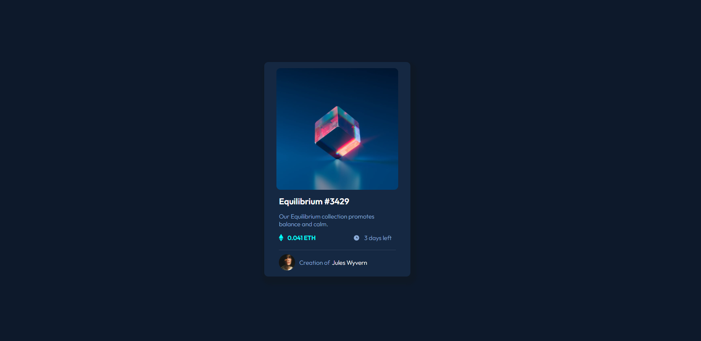

# Frontend Mentor - NFT preview card component solution

This is a solution to the [NFT preview card component challenge on Frontend Mentor](https://www.frontendmentor.io/challenges/nft-preview-card-component-SbdUL_w0U). Frontend Mentor challenges help you improve your coding skills by building realistic projects. 

## Table of contents

- [Overview](#overview)
  - [The challenge](#the-challenge)
  - [Screenshot](#screenshot)
- [My process](#my-process)
  - [Built with](#built-with)
  - [What I learned](#what-i-learned)
  - [Continued development](#continued-development)
  - [Useful resources](#useful-resources)
- [Author](#author)


## Overview

### The challenge

Users should be able to:

- View the optimal layout depending on their device's screen size
- See hover states for interactive elements

### Screenshot




## My process

### Built with

- Semantic HTML5 markup
- CSS custom properties
- Flexbox
- Mobile-first workflow


### What I learned

The aim of the project is to present skills in html and css. Additionally, it shows the ability to use Flexbox technology.Thanks to this exercise, I consolidate my skills acquired on the Fronted Developer course financed as part of an EU project.

To see how you can add root, see below:


```css
:root {
--white: hsl(0, 0%, 100%);
--light-gray: hsl(212, 45%, 89%);
--grayish-blue: hsl(220, 15%, 55%);
--dark-blue: hsl(218, 44%, 22%);
}
```


### Continued development

In the future, I want to focus more on CSS Grid technology and its understanding and use in tasks. Another goal will also be the development of the use of Web Accessibility.


### Useful resources

- [flynerd.pl](https://www.flynerd.pl/2018/06/jak-napisac-dobre-readme-projektu-na-githubie.html) - This helped me writing a good file of README.md. I really liked the explanation of the writing README file and shows on which point I must focus.


## Author

- Website - [Add your name here](https://www.your-site.com)
- Frontend Mentor - [@yourusername](https://www.frontendmentor.io/profile/yourusername)

